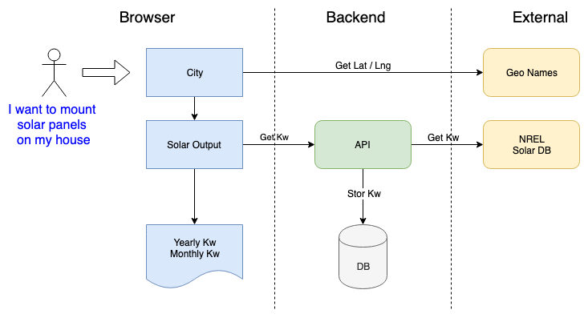

# Application Configuration

This demo application serves to illustrate secure application configuration on Kubernetes.

## architecture


## local development

first install all dependencies for the backend and the frontend. From the repo root run:
```
npm run install-all
```
Start the frontend, backend development servers and the postgres database:
```
npm run start-all
```
All the logs will be visible in the same shell.
